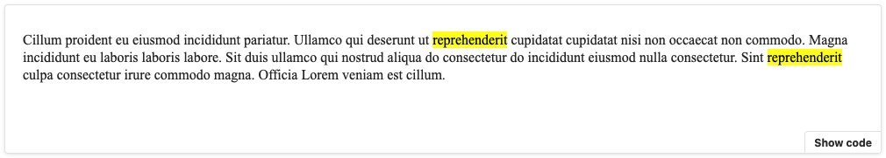

🍬 A React wrapper around the popular [mark.js](https://markjs.io) library.

# ⚡️ Quick Links

- [Docs](https://www.appsparkler.com/docs/react-mark-js/?path=/docs/introduction--single-string)
- [Stack Blitz Demo](https://stackblitz.com/edit/react-mark-js?file=src/examples/MarkerExamples/index.js)

# ⚡️ Installation

The best way to install `react-mark.js` is via the
`npm` package which you can install with `npm` (or `yarn` if you prefer)

## 📦 NPM

```sh
npm install -S mark.js react-mark.js
```

## 📦 Yarn

```sh
yarn add mark.js react-mark.js
```

# ↘️ Importing Components

```jsx
import { Marker } from "react-marker.js";
```

# 🖌 Basic Example

```jsx
import { Marker } from "react-mark.js";

export default () => (
  <Marker mark="reprehenderit">
    Cillum proident eu eiusmod incididunt pariatur. Ullamco qui deserunt ut
    reprehenderit cupidatat cupidatat nisi non occaecat non commodo. Magna
    incididunt eu laboris laboris labore. Sit duis ullamco qui nostrud aliqua do
    consectetur do incididunt eiusmod nulla consectetur. Sint reprehenderit
    culpa consectetur irure commodo magna. Officia Lorem veniam est cillum.
  </Marker>
);
```


